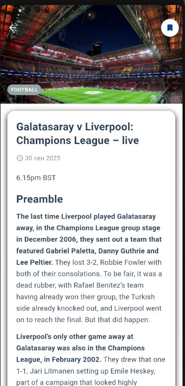
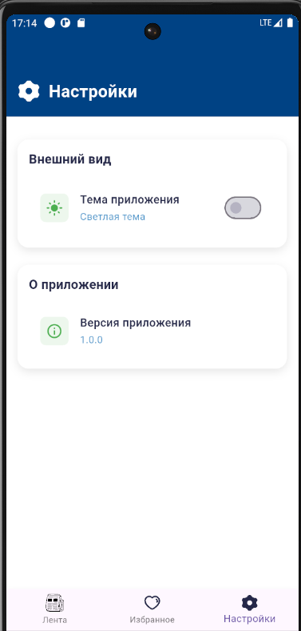

# 📱 Guardian News App

Приложение на Flutter для чтения новостей с [guardianapis.com](https://open-platform.theguardian.com/).  
Поддерживает избранное и поиск по статьям.  

<div align="center">
  
  
  
  
</div>
---

## ✨ Функционал
- 📄 Лента новостей с карточками  
- 🔍 Поиск по статьям  
- ⭐ Добавление в избранное  
- 📑 Детальный экран статьи  
- 🌙 Поддержка тёмной/светлой темы  

---

## 🛠️ Стек технологий
- **Flutter**  
- **Drift**  
- **Dio** 
- **Retrofit**  
- **AutoRoute** 
- **MVVM** 

---

## 🏗️ Архитектура
Проект разделён на три слоя:  
- **Data** → API (Dio/Retrofit), база (Drift)  
- **Domain** → UseCases, сущности  
- **Presentation** → ViewModels, UI (Flutter widgets)  

---

## 🚀 Запуск
1. Клонировать репозиторий:
   ```bash
   git clone https://github.com/username/guardian-news-app.git
